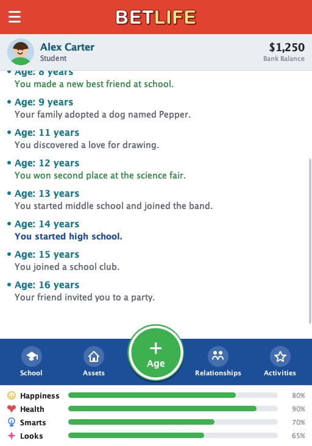

# BetLife

BetLife is a life-simulation game: you guide a character from one year of life to the next,
choosing how to spend each year on school, work, activities and the people around you while random
life events and decisions shape the story in the journal. It is one of the four games of the
AP-CS-Arcade project.

**Version 1.0.0 — first playable version.** See [INTEGRATION.md](INTEGRATION.md) for how the
arcade launches it.



## Technology
- Java 17
- Java Swing (no JavaFX, no external libraries, no build tool)

## Compile and run
From this directory:

```bash
./compile.sh
./run.sh
```

or manually:

```bash
javac -d out $(find src -name '*.java')
java -cp out betlife.Main
```

## How to play
- **Age** (the green button) moves life one year forward. School advances, salary and living costs
  are settled, relationships drift, and one life event happens. Some events ask you to decide.
- Each year you have **6 actions** to spend on school, work, activities and relationships.
- **Bottom navigation:** School / Career / Jobs (depends on your situation), Assets, Relationships,
  Activities. The **menu** (top left) shows the version and lets you exit or return to the arcade.
- Every screen has a back arrow; nothing is a dead end.

## Features
- Main life screen: character strip, journal grouped by year with milestone colours, stats.
- Education: 10th to 12th grade, graduation, a "What's Next?" decision, university with four majors
  over four years, school and university actions.
- Career: job board with requirements, hiring, salary paid yearly, performance, Work Harder,
  Take It Easy, Quit.
- Activities: Library, Mind & Body, Recreation, Doctor (paid checkup), Shopping.
- Relationships: family and friends, closeness meters, Spend Time / Compliment / Argue, yearly drift,
  new friends from events.
- Assets: bicycle and car with purchase validation, net worth, yearly expenses.
- Simulation: life stages, yearly action budget, 25 original random events (10 with decisions),
  seeded randomness for tests.

## Project structure
```text
src/betlife/
├── BetLifeLauncher.java      public launch API (standalone / from arcade), VERSION
├── Main.java                 standalone entry point
├── game/
│   ├── BetLifeGame.java      game state and every player action
│   ├── AgeProcessor.java     what happens when a year passes
│   ├── LifeEventEngine.java  the event pool and yearly event selection
│   ├── RandomEvent, Decision, Choice, EventEffect, JobBoard
├── model/                    Player, EducationState, CareerState, Job, Relationship, Asset,
│                             ShopItem, LifeEvent, LifeStage
└── ui/
    ├── BetLifeFrame.java     the window; exit callback for the arcade
    ├── ScreenNavigator.java  CardLayout switcher; screens are created once and refreshed on show
    ├── ActionScreen.java     base for secondary screens (header, summary, action rows, budget)
    ├── MainLifePanel, SchoolPanel, UniversityPanel, JobsPanel, CareerPanel, AssetsPanel,
    │   RelationshipsPanel, RelationshipDetailPanel, ActivitiesPanel, LibraryPanel,
    │   MindAndBodyPanel, RecreationPanel, DoctorPanel, ShoppingPanel, MenuPanel
    ├── Theme.java            colours, fonts and sizes
    └── components/           painted widgets: headers, buttons, dialogs, rows, meters, icons
```

## Not in 1.0 (planned)
Character creation, save/load, end of life, marriage and children, housing, more events and jobs.
